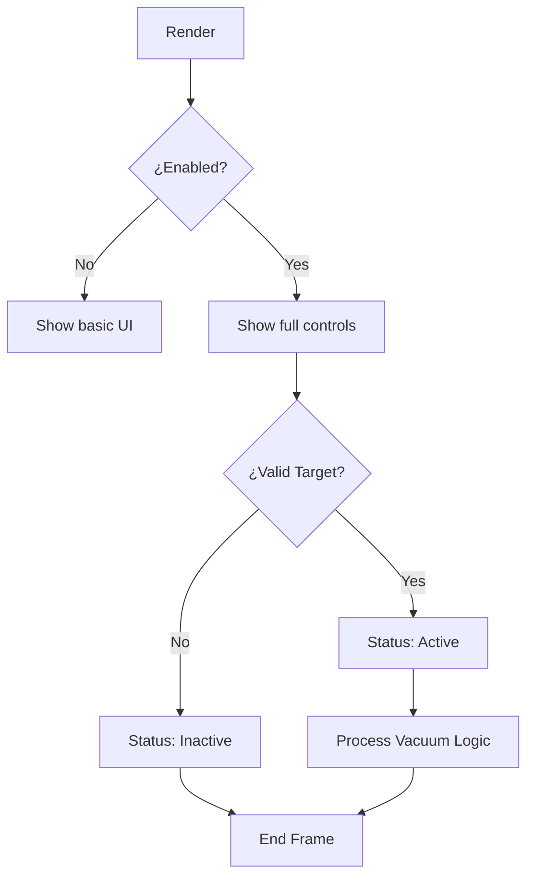

# Mob Vacuum - Código C++ Transformado

## 📋 Descripción

Este proyecto contiene la transformación del código decompilado de la función "Mob Vacuum" a C++ moderno y legible. El código original era pseudo-C++ generado por un decompilador, con nombres de funciones ofuscados y estructura poco clara.

## 🔄 Transformación Realizada

### Código Original (Decompilado)
```cpp
__int64 sub_180047570() {
    __int64 v0; // r8
    char v1; // al  
    __m128i si128; // xmm0
    // ... código ofuscado
}
```

### Código Transformado (C++ Limpio)
```cpp
class MobVacuum {
public:
    int64_t Render();
    int64_t Initialize(); 
    int64_t Update();
    // ... métodos bien documentados
};
```

## 🏗️ Estructura del Proyecto

```
├── mob_vacuum.h          # Declaraciones de clase y estructuras
├── mob_vacuum.cpp        # Implementación principal
├── CMakeLists.txt        # Configuración de compilación
└── MOB_VACUUM_README.md  # Este archivo
```

## 🔍 Análisis de la Transformación

### Mapeo de Variables Globales
- `xmmword_180062150` → `g_mob_vacuum_config[16]` (configuración principal)
- `xmmword_180062160` → `g_mob_vacuum_settings[16]` (configuración adicional) 
- `xmmword_180058E30/E20` → `g_active_color/g_inactive_color` (colores de estado)

### Mapeo de Funciones
| Original | Transformado | Propósito |
|----------|-------------|-----------|
| `sub_180047570()` | `MobVacuum::Render()` | Renderizado de UI principal |
| `sub_180047E90()` | `MobVacuum::Initialize()` | Inicialización del sistema |
| `sub_18004E436()` | Error handler | Manejo de errores de actualización |
| `sub_18004E2A0()` | Error handler | Manejo de errores de renderizado |

### Mapeo de Memoria
```cpp
// Configuración principal (16 bytes alineados)
struct MemoryLayout {
    uint8_t  padding[4];     // Bytes 0-3
    bool     enabled;        // Byte 4 - BYTE4(xmmword_180062150)
    uint8_t  padding2[3];    // Bytes 5-7  
    uint32_t input_type;     // Bytes 8-11 - DWORD2(xmmword_180062150)
    float    range;          // Bytes 12-15
};
```

## 🎮 Funcionalidad del Mob Vacuum

### Características Principales
1. **Toggle de Activación**: Interruptor para habilitar/deshabilitar
2. **Selector de Tipo de Input**: Configuración del tipo de entrada
3. **Control de Rango**: Slider para ajustar el rango de detección
4. **Control de Distancia**: Slider para ajustar la distancia de acción
5. **Indicador de Estado**: Muestra "Active" o "Inactive" con colores

### Flujo de Ejecución


## 🛠️ Compilación

### Prerequisitos
- C++17 compatible compiler (GCC, Clang, MSVC)
- CMake 3.15+
- AVX/AVX2 support (opcional, para SIMD)

### Comandos de Compilación
```bash
mkdir build
cd build
cmake ..
make
```

### Para Windows (Visual Studio)
```cmd
mkdir build
cd build
cmake .. -G "Visual Studio 16 2019"
cmake --build . --config Release
```

## 🎯 Mejoras Implementadas

### 1. **Orientación a Objetos**
- Encapsulación en clase `MobVacuum`
- Separación clara de responsabilidades
- Métodos privados para lógica interna

### 2. **Documentación Completa**
- Comentarios Doxygen en todas las funciones públicas
- Explicación de cada parámetro y valor de retorno
- Mapeo claro con el código original

### 3. **Manejo de Errores Robusto**
- Try-catch blocks para prevenir crashes
- Logging consistente de errores
- Estados de error bien definidos

### 4. **Configuración Type-Safe**
- Enums class en lugar de magic numbers
- Estructuras bien definidas para configuración
- Validación de tipos en tiempo de compilación

### 5. **Compatibilidad Retroactiva**
- Wrappers `extern "C"` para mantener compatibilidad
- Mismas signatures de funciones originales
- Layout de memoria idéntico

## 🔧 Funciones Externas Requeridas

El código transformado asume la existencia de las siguientes funciones (que deberían implementarse según el engine de juego específico):

```cpp
extern void SetWindowTitle(const char* title);
extern void CreateToggleButton(const char* label, bool* value_ptr);
extern void BeginFrame();
extern void CreateInputSelector(const char* label, int* current_item, int register_val, void* item_list);
extern bool CheckTargetValid(uint32_t entity_type, uint32_t input_type);
extern void DisplayText(__m128i* color, const char* format, ...);
extern void CreateSlider(const char* label, int data_type, float* value_ptr, int* min_val, int64_t* max_val, const char* format);
extern int64_t EndUIFrame();
extern void LogMessage(int level, const char* message);
```

## 📊 Constantes Importantes

### Valores Numéricos del Código Original
- `3212836864LL` = Valor máximo para range slider
- `1176256512` = 900.0f en representación hexadecimal de float
- `1140457472` = 100.0f en representación hexadecimal de float

### Estados del Sistema
- Level 0 = Info messages
- Level 3 = Error messages
- Input Type 0 = Disabled
- Input Type 1 = Enabled

## 🚀 Uso

```cpp
#include "mob_vacuum.h"

int main() {
    MobVacuum vacuum;
    
    // Inicializar
    if (vacuum.Initialize() != 0) {
        // Loop principal del juego
        while (game_running) {
            vacuum.Render();  // Renderizar UI
            vacuum.Update();  // Actualizar lógica
        }
    }
    
    return 0;
}
```

## 📝 Notas Técnicas

- El código utiliza alineación de 16 bytes para compatibilidad SIMD
- Los punteros se usan para mantener compatibilidad con el layout de memoria original
- Las constantes numéricas se mantienen para preservar la funcionalidad exacta
- El manejo de excepciones previene crashes del juego host

## ⚠️ Advertencias

Este código está diseñado para un entorno de modificación de juegos (game hacking/modding). Asegúrate de:
1. Cumplir con los términos de servicio del juego
2. Usar solo en entornos de desarrollo/testing
3. No distribuir sin permisos apropiados
4. Implementar las funciones externas según tu engine específico